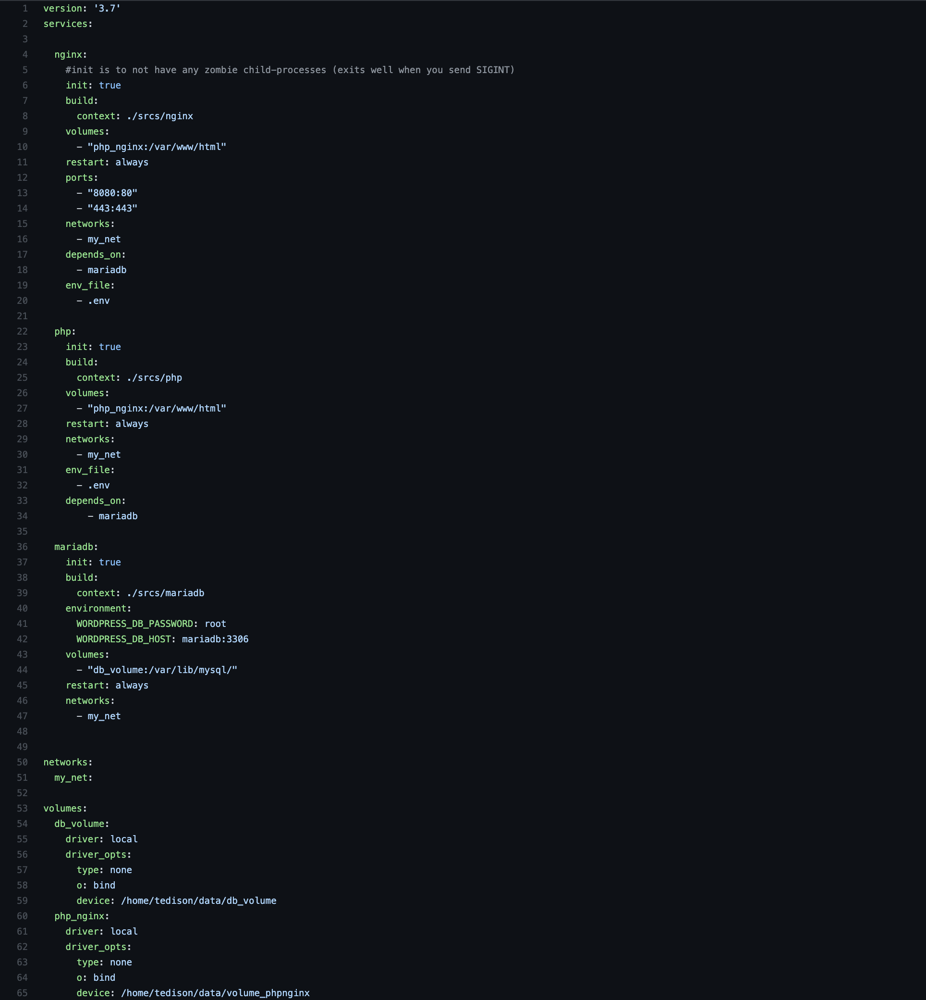
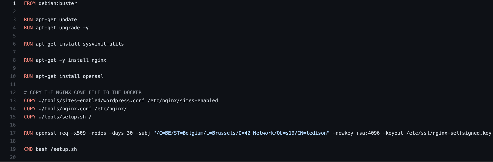
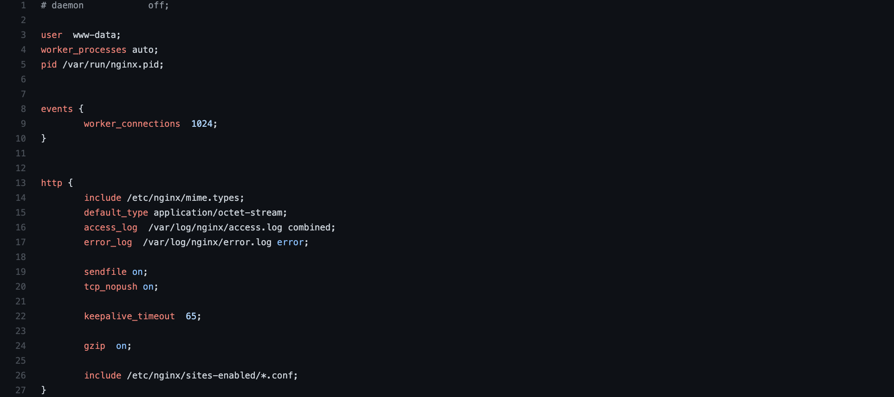
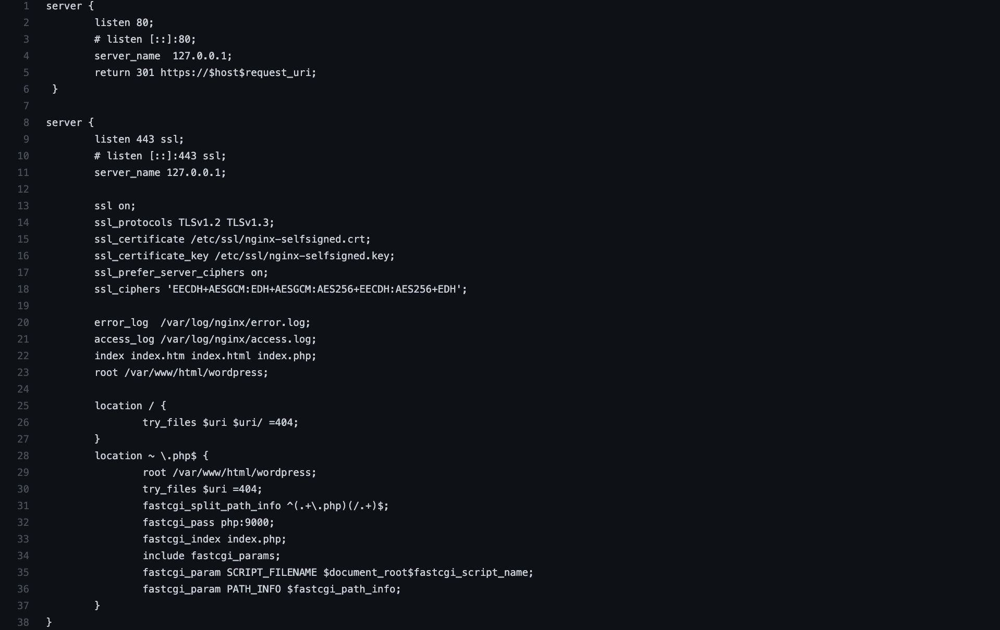
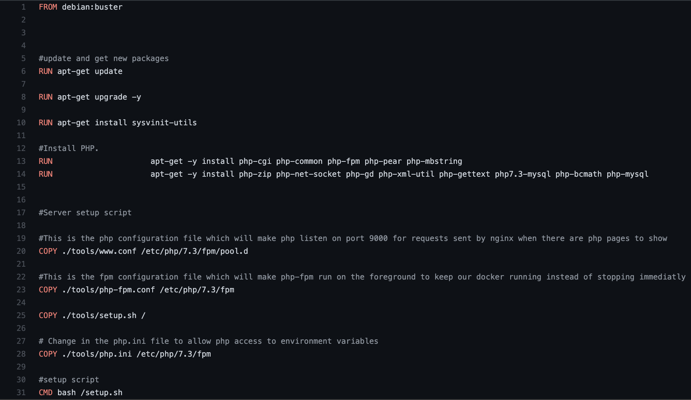
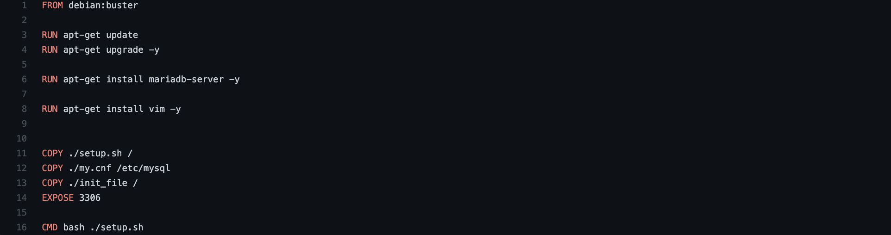

# Deploying a Wordpress site running NGINX, php-fpm and MariaDB using docker-compose

This tutorial is designed to help you understand how to deploy your own Wordpress website running NGINX, php-fpm/Wordpress and MariaDB using docker-compose.

## Building your own images
The specificity of this tutorial is that we are going to be building our own images as opposed to grabbing pre-built Wordpress, NGINX, etc. images from the docker container image library.

# The basics
Docker-compose is a service of docker that allows you to build multiple containers and to have them communicate between each other in a simple way, while still having an isolated environment.

For this particular tutorial, we will need to define three services : NGINX, which will take care of accepting HTPPs requests from a browser and fetching the correct php page from our second container, the php-fpm/Wordpress. FPM is an interface designed to be the bridge between a webserver (our NGINX container) and php, via the FastCGI protocol.
Our third service, MariaDB, is there to handle the Database. What happens when a webpage is requested by a user is that NGINX gets the request, transfers it to PHP-fpm via FastCGI. PHP then needs to fill the php page with data from our database to populate the webpage. So PHP-fpm needs to be able to communicate with our third container, MariaDB. 
In this project, we will want the data stored in the DB to be persistent, so we will need to use the docker-compose feature "volumes". This will be a handy tool that allows us to have a shared directory between our host machine and our MariaDB container.

# docker-compose.yml
Beware of the indentation chosen to write this file. To have the file work, you will need to have 2 spaces set as your tabs. 

In the first line of the docker-compose file, we first define the version of docker-compose we want to use. I chose version 3.7 but feel free to use another one, this was an arbitrary choice on my part. 

Afterwards, we use the "services" keyword. In that part we will add our 3 services : NGINX, MariaDB and PHP-fpm. This will tell docker-compose that he needs to build 3 containers from the respective Dockerfile. 

Under the services part, we have a "networks" part, which is there to tell how our containers can communicate. Here we use one network for our 3 containers so they can potentially all communicate between each other (we will still need to open the correct ports for each container of course). The network uses the default settings, and "bridges", that's why I didn't specify anything in the network section. 

Lastly, we have our volumes section, which defines the "shared directories" between our host and containers. We will need one for our DB and one shared between our host and the NGINX and PHP-fpm/Wordpress containers. We need one shared between these two because NGINX and PHP-fpm need to be able to have access to the same files. When NGINX tells PHP-fpm it needs to populate this particular .php file, it needs to have access to that file. 
So, our db_volume and volume_phpnginx are defined, we still need to tell what directory from our host file needs to be shared to the containers, this is under the "device" section. The rest of the options are pretty common and don't need an explanation here. They are standard for shared volumes.

## Going into our services' details

### init : 
init is a keyword used to allow the host to pass on signals to the containers and to reap zombie processes. This is very useful to stop our containers' running process with a CTRL-C for example as well as to avoid having any terminated but undeleted processes in our container. 

### build : 
build is used to define where the files and more importantly the Dockerfile of your service will be located. If it's in the folder /srcs/nginx/ then this will become the working directory of your container during the build of its image.

### volumes :
This keyword defines which created volumes need to be mounted inside the container and well as the the directory where it needs to be! 
so :
- "php_nginx:/var/www/html" means that the php_nginx volume will be mounted at the location /var/www/html inside the container. What's really important to note is that if this directory exists already inside your docker, all the content will be replaces by what's inside your volume.

### restart :
restart specifies that if a crash happens, or if your container is shuts down, it will always reboot.

### ports :
This is pretty straightforward. "8080:80" will open the port 8080 of your host machine to the port 80 of your container.

### networks :
What's the network(s) that your container should be on. 

### depends_on : 
This means that your container will not launch until the one it depends on has started. This is just for the startup of the container, not the actual service that it is running (NGINX, php-fpm or MariaDB).

### env_file :
This will specify where docker-compose needs to looks for a environment variables file. This contains multiple environment variables that are useful and more secure than hardcoding passwords in the Dockerfile for example.

# NGINX

Let's get straight into it with our NGINX container, this is a pretty easy container to set up. The dockerfile specifies what OS it will have to use, so Debian Buster in our case. Next, we update the packages available for us on apt. We download the necessary ones : nginx, and openssl (which will generate our ssl certificate).
We copy our setup script into our container, as well as our NGINX configuration files into the correct directory.
We then launch our setup script with bash.

## conf files

nginx.conf will tell NGINX how our server needs to behave in general.

Most of the configurations in this file I didn't have to modify, so I don't have too much information on them, it's a standard NGINX webserver configuration.

wordpress.conf is in the sites-enabled directory, which basically tells NGINX that this wordpress site is "enabled" and how it should behave.

This file is way more interesting. First off, you have two server blocks. This tells NGINX that your have two sockets opened to connections, one that listens to port 80, you can also uncomment the second listen to have IPv6 enabled for that socket. The server name is local in my case so 127.0.0.1 and the only thing that this socket does is redirect you to the second socket, which is the HTTPs one.

The second socket is listening to the 443 port, which is the one typically used for ssl connections. We need to specify that ssl is on, and that the protocol used is TLSv1.2 or TLSv1.3. We also need to tell where the certificate created earlier by openssl is in our container so that NGINX can go get it. Next, we need to tell NGINX what the index will be. Programmers usually call that page index.htm(l) but it can also be (like for a Wordpress website) a php page, so we add index.php.

Next we tell NGINX that the root of our website will be located in that specific folder. That folder is the same one that is being shared by our host via our Volume. You will place a downloaded version of Wordpress in that folder in your host, so NGINX, as well as php-fpm has access to theses files.

Next, we tell NGINX what it should do when it doesn't find a file. (redirect 404)

And lastly we tell NGINX how it should treat PHP files. This is the part where we tell NGINX how it should communicate with our php-fpm volume. The root should be the same as our other root. But the crucial line here is the fastcgi_pass. Docker-compose allows us to just specify the name:port of another container if they are in the same network and docker-compose automatically replaces that with the correct IP and port number of the specific container. So in that case, we tell docker-compose to replace php:9000 by the correct ip at port 9000 so that the fastcgi forwards the requests of php pages to our php container!

## setup.sh

The only purpose of this script is to launch the NGINX process in the foreground as opposed as to how it is generally launched : a daemon. We can't use "tail -f" or handy tricks like that and if you don't have an active process in your container, once it's done executing everything it just stops. So we need nginx to run with the specific option of "daemon off;".

# PHP-fpm

Same as before with NGINX, debian:buster and we install the necessary packages for our container to run php-fpm. We need php-mysql so that php is able to communicate with a database. 

We copy our script as well as the configuration files into the correct folders so that php-fpm knows what is has to do. For example, the www.conf file, this makes php listen on port 9000 for requests of php pages. 
You have to test out for yourself, but I'm 90% sure you only need the www.conf file is the only one needed. I made some changes in the commands that I run in the script as well as in the Wordpress config files so that the php-fpm.conf file and php.ini files are not needed. (again, I'm not 100% sure, so test it out). I will skip these two unnecessary files in the following explanation, but feel free to look at the comments in the Dockerfile, they give a brief explanation as to what these files are supposed to do.

## www.conf

As stated above, the only important point and the only one I modified from the one that is by default in our php container is the line "listen = 9000" that says on what port php-fpm should listen to. This is done to allow the NGINX requests to get to php-fpm.

## setup.sh

We create a directory /run/php so that php is able to launch. 
We then run php-fpm7.3 in the foreground. The reason for this is the same as for NGINX, we need php-fpm to run in the foreground as an active process to not allow our container to stop. The flag --fpm-config is probably unnecessary, because it states the configuration file of the service, which itself is unnecessary.
But you can keep it in, it doesn't change much.

# MariaDB

Just get the required packages with apt-get. Then copy the setup script inside the docker, a configuration file and a MYSQL initialization file, which will specify some settings of our Database user.

## my.cnf

This file is really important. It allows you to set MariaDB to listen to TCP requests as opposed to communicating locally via UNIX sockets. The important points are located under the [mysqld] section, which is the MYSQL server process. You have to disable the skip-networking option as well as skipping the binding address. Once this is done, your MariaDB databases can interact and receive queries from the outside of your container.

## init_file

This will be fed to mysql when it is launched, it changes the password on the root user of MYSQL, which is one of the requirements of the 42 subject pdf (the reason why I did this project). 

## setup.sh

This is surely not the most efficient way to do what is happening here. I figured it out the wrong way. So, for the uncommented lines first, you change the owner of the /var/lib/mysql/ folder with chown (the -R flag is to have it happen recursively, so that the content's owner is changed also) as well as change the authorizations on the same folder with chmod. This should be done on the folder in your HOST (/home/login/data/db_volume) first, so it's normally unnecessary to do it as well in your container but I do it just in case. The last line is just launching mysqld in safe mode, with the init_file to change the root password. 
Now, for the commented lines, these should be uncommented BUT ONLY the first time your launch your docker-compose once you think everything is ready. Then you should comment them again, all of them, that includes the "service mysql start;" and "service mysql stop;". If you don't, you will have created all the tables in the Wordpress database, but the commented lines modify them in a weird way again and Wordpress detects this as if your don't have Wordpress installed yet. Even though you just did.

# Volumes

As stated above, you should have two directories in this spot on your host machine : /home/tedison/data/. One is db_volume and will be populated the first time you run your containers and every time you add a new article, comment, user, etc. on your Wordpress website.
The other folder is volume_phpnginx and you will have to put inside it a folder named wordpress which will contain a version of Wordpress of your choice. You can either create and modify a wp-config.php file in the same folder, otherwise it will be created automatically the first time you run Wordpress. Speaking of which, you will have to fill in some info at that moment : 
- the name of the dabatase : wordpress
- db_host : mariadb:3306
- db_user : rootTCP
- db_password : root

With all of this, your docker-compose project should run smoothly!
